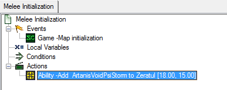
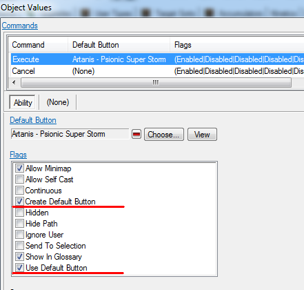
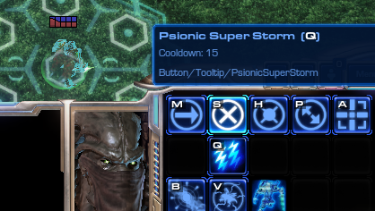

# 基本拼写交换系统

!!! info
    本教程旨在面向初学者友好，但需要对数据和触发器有一些基本经验，因为我们需要同时使用这两个模块。触发器部分将涉及动作定义的创建，以及使用目录触发器和数据表。总共将制作5个触发器，每个触发器都相当简短。教程末尾附有一个示例地图以作参考。

## 简介

在5.0版本，暴雪为我们带来了一项新功能："**动态能力支持**"

>**Dynamic Ability Support**
>
>    制作者现在可以使用触发器为单位添加或移除能力。

我们将利用这一功能制作一些非常酷的东西。

以下是我们的教程目标：

**目标 1** – 通过触发器为单位添加能力，了解这一功能的工作原理。

**目标 2** – 创建一个简单的能力装备/卸下系统，设置快速且易于操作。

## 目标 1 – 能力添加测试

**我们将要做什么：**

我们的目标是通过触发器成功为单位添加一个能力。

**步骤：**

让我们拿一个 Zeratul 并将他放在地图上。从现在开始，我们将把这个单位称为"***英雄***"。

我们想看看触发器是如何工作的。打开触发模块，删除“地图初始化”触发器中的默认动作，然后创建一个名为“**添加能力**”的新动作。让我们给我们的英雄添加一个名为"***ArtanisVoidPsiStorm***"的能力。

如果我们现在测试文档，或通过编辑器启动地图，我们会注意到什么也没发生。让我们检查一下该添加能力动作的描述。

>添加的能力可能无法在没有命令按钮的情况下使用。您可以设置一种能力以自动创建命令按钮，方法是转到能力的“Commands+”字段，并分配一个默认按钮给它们。务必选中“使用默认按钮”和“创建默认按钮”标志，以允许按钮自动创建。自动创建的按钮位置可以设置在按钮数据中。

让我们就这么做。在我们将要分配的能力（"***ArtanisVoidPsiStorm***"）中，转到“**Commands+**”字段，并按照提示，选中“**使用默认按钮**”和“**创建默认按钮**”标志。

之后，转到与执行命令关联的按钮（"***Artanis - Psionic Super Storm***"）并找到名为“**Default Button Layout+**”的字段。将“**CardID**”设置为“0001”，“**Column**”设置为“1”，“**Row**”设置为“1”。请注意，列从0到4，行从0到2。应该很容易弄清楚放什么来达到所需的按钮位置。

现在，再次启动地图。一切都应该正常工作！如果不小心出错，教程底部有一个地图可供参考。

## 目标 2 - 能力拾取/交换系统。

**我们将要制作：**

地图上将放置不同的能力存储在拾取物中。将鼠标悬停在拾取物上会显示有关其提供的能力的信息。玩家将能够用他们的英雄右键单击它们，使他们的英雄靠近拾取物并与其互动 - 从而获取其中存储的能力，并在此过程中摧毁拾取物。

由于技术的限制，所有能力必须在命令卡上预先定义位置。我们将设计我们的系统，使3种能力占据单位命令卡左下角的前三个按钮（我们将它们称为 Q、W 和 E 槽）。

如果我们的英雄获得了一个已经被其他能力占用的槽位的能力 - 在装备新能力之前，他们将移除并丢弃当前装备的能力。

**我们将如何做：**

为了创建这样一个系统，我们需要完成5个任务：

**1) 数据准备。** 首先，我们需要创建一种将作为拾取物的单位类型。我们将创建一个英雄将与拾取物互动的能力。

**2) 存储触发器。** 接下来，我们需要创建一个触发器，使拾取物单位储存所选择的能力，并显示该信息。

**3) 数据准备。** 另外，我们需要为使用配置能力（检查这些标志，定义命令卡上的位置等）。

**4) 装备/卸下触发器。** 此外，我们需要创建一个触发器，在英雄与拾取物互动时，将能力从拾取物转移到英雄身上。

**5) 整合触发器。** 最后，我们需要在交互触发器中将所有内容绑定在一起。

所有与数据有关的信息都将是简单的 – 我们只会更改数值。

触发器部分主要是从数据中获取信息，并通过数据表保存/检索信息。

### 部分 1 – 准备/数据

**目标：**

创建一种用作拾取物的单位类型，并创建一个英雄与拾取物互动的能力。

**步骤：**

#### 步骤 1 – 拾取物单位：

我们的目标是创建一个拾取物错觉单位，通过触发器在其中存储能力引用。

为此，让我们复制“***New Equipment***”单位，并将副本命名为“***能力拾取***”（还清除其能力字段，因为我们不需要它）。我们计划在拾取物单位的工具提示中显示能力信息，为此，我们需要转到拾取物单位的“**Flags+**”字段，并取消选中“**无工具提示**”标志。此外，我们将给该单位一个未使用的碰撞标志（“**Air16**”很好），这样当它们被放置在地面上时，拾取物将不会堆叠在一起。