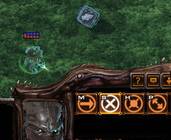
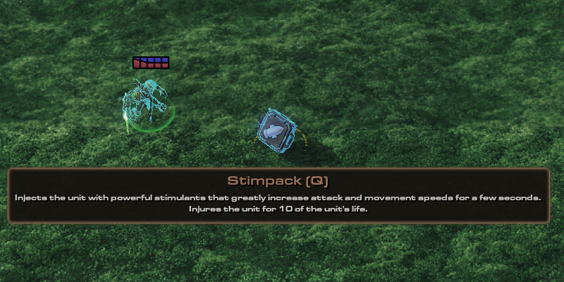
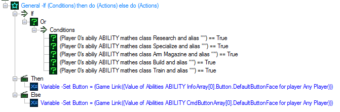

现在让我们为英雄拾取互动创建一个技能。它将具有一个单一的“Set”效果和一个验证器，确保该技能只能激活在我们选择的特定单位类型上。

1）创建一个“Effect - Target”技能。命名为“Pickup Interact”。然后，创建一个新按钮，或将任何现有按钮添加为“Execute”命令的“默认按钮”（“Commands+”字段）。我决定使用“Pickup Scrap Small”按钮。

2）创建一个类型为“Unit Type”的验证器，然后将其值字段设置为“Ability Pickup”（这是我们刚刚复制的单位）。

3）创建一个“Set”效果，然后将我们的“Ability Pickup”验证器添加到我们刚刚制作的效果的验证器字段中。

4）在“Pickup Interact”技能中，将效果字段设置为我们新创建的“Set”效果。然后，转到标记并勾选“Smart Command”。这将确保单位在右键单击时自动使用该技能（但我们的验证器使其只能在右键单击“Ability Pickup”单位时执行）。

5）将此技能添加到Zeratul。由于这是一个智能技能，因此我们可以不用将按钮添加到命令卡中。

#### 步骤3 – 触发器：

创建一个新触发器，并命名为“Pickup Interact”。目前，我们将使用此触发器简单地测试一切是否正常运行，一旦一切都完成后，我们将再次使用它。

事件 – “单位使用技能”。在“Ability”中选择我们的“Pickup Interact”技能。在“阶段”中选择“Effect3– Cast”。

动作 – “Add Ability”和“杀死单位”。在“Add Ability”动作中，对于Ability，我们可以将其设置为“ArtanisVoidPsiStorm”，对于Unit，我们可以设置为“触发单位”。对于“杀死单位”动作，将单位设置为“触发技能目标单位”。这样，我们的技能不会在地图初始化时获得，而是当我们的英雄右键单击拾取单位时获得。

让我们检查一下是否正常工作。首先，从地图初始化触发器中删除“Add Ability”动作，并将“Ability Pickup”单位放在我们的英雄旁边，然后启动地图。用我们的英雄右键单击拾取的虚拟单位，应该使我们的英雄获得Psi风暴技能并摧毁拾取单位。

### 第2部分 – 使拾取单位存储技能数据。

目标：

创建一个触发器，使拾取单位存储所选技能+显示该信息。

概述：

我们希望做两个事情：

1）当鼠标悬停在拾取单位上时，显示技能的信息（名称、快捷键、描述）。我们将使用目录触发器访问与链接到技能的按钮相关的必要文本。

2）将技能标识符存储在单位中。我们可以通过数据表来实现这一点。

流程：

### 步骤1 – 当鼠标悬停在拾取单位上时显示信息：

首先，我们将创建一个新的动作定义（在触发器模块中，右键单击左侧的空白区域 -> 新建 -> 新建动作定义）。让我们命名为“Set Pickup AbilityValue”。我们将为其赋予2个参数–“Unit”（命名为“UNIT”）和“游戏链接–技能”（命名为“ABILITY”）。

然后创建一个文本类型的本地变量，命名为“Button”。

#### 步骤1.1 – 获取按钮。

在动作中，将我们的“Button”变量设置为“将字符串转换为游戏链接”。

在字符串的值中，选择名为“目录字段值获取”的函数。

在目录中，选择预设->“Abilities”，在条目中设置我们的“ABILITY”参数。对于范围字段路径，请选择“Effect- Target”。然后，在字段中选择“CmdButtonArray”。此外，选择“0”作为索引，并在字段中选择“Default Button Face”。

>      变量 -将按钮设为（游戏链接（玩家任意玩家的Abilities ABILITY CmdButtonArray[0].DefaultButtonFace的值））

现在我们可以轻松地访问所使用的按钮。我们可以使用目录触发器获取其目录文本值。

但值得注意的是，这只会获取那些只有一个主执行按钮的技能的按钮（例如“Effect - Target”、“Effect - Instant”、“Behavior”、“Augment”等）。像“Train”、“Specialize”、“Research”等技能有一个命令数组。如果我们要获取其中一个按钮信息，流程是相同的，直到我们需要设置范围的路径。取代“Effect – Target”，放置“Train”或其他使用命令数组而不是单个命令的技能类型。之后，我们需要选择“InfoArray”而不是“CmdButtonArray”，然后选择要提取按钮链接的数组位置（暂时选择数组的第一个条目 - 索引0）。

完成后，我们现在需要区分具有一个命令的技能和具有命令数组的技能之间的区别。幸运的是，通过名为“Ability Matches Filters”的函数，我们可以在触发器中找到技能类型。如果技能是某种特定类型，则应使用按钮获取函数设置1，否则执行设置2。

#### 步骤1.2 – 从按钮获取文本。

现在我们已经获得了按钮，我们可以从中提取文本并为工具提示显示做准备。

我们创建4个文本类型的变量。我们将它们命名为“Name”、“Description”、“Hotkey”、“Final Text”。

将“Name”变量设置为“将游戏文本转换为文本”。在路径中，选择名为“目录字段值获取”的函数。然后，对于目录，选择预设–“Buttons”，然后对于条目，选择我们的“Button”变量。对于字段，选择“Name”。

将“Description”变量也设置为相同的内容，但是为目录的字段选择“Tooltip”。

“Hotkey”将略有不同，因为我们将不得不使用“将游戏快捷键转换为文本”的函数，而不是通常的游戏文本（对于路径，再次使用同一“目录字段值获取”函数）。