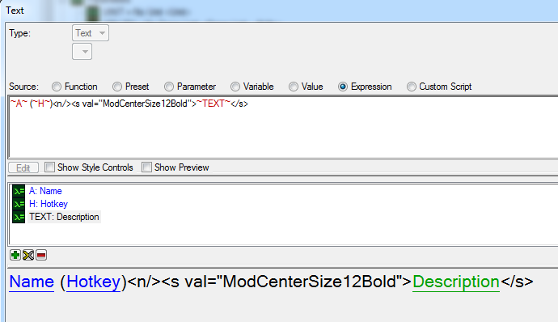
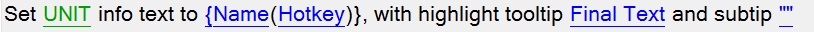
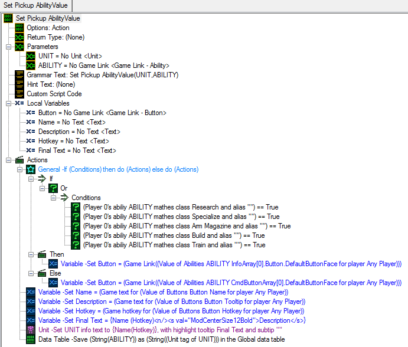

现在我们有了所需的所有信息，可以以任何想要的方式显示它！我选择使用表达式将所有收集到的信息合并到一个“***Final Text***”变量中。

要使捡起单位显示所有这些文本，我们将使用“**Set Unit Info**”操作。“**Info Text**”是在单击单位时在指令卡上显示的内容，“**Highlight Tooltip**”是工具提示。

应用所选格式。

#### 第2步 - 存储能力。

现在，我们将在数据表中的一个条目中存储能力标识符，该条目将在捡起单位的单位标签之后命名。这样，只要我们拥有捡起单位，就可以找到其数据表条目。如果您不熟悉数据表，您可以在这里阅读更多：https://s2editor-guides.readthedocs.io/New_Tutorials/03_Trigger_Editor/041_Data_Tables/（简而言之，这些是可以动态创建和销毁的变量）。

创建一个名为“**Save Data Table Value (String)**”的新操作。对于值，请使用名为“**Convert Game Link to String**”的函数，然后对于游戏链接，选择“***ABILITY***”参数。对于名称，我们可以使用单位的标签。选择“**Convert Integer To String**”函数，然后选择“**Unit Tag**”函数。对于单位，选择“***UNIT***”参数。

完成！

### 第3部分 - 准备能力。

如前所述，要通过触发器将能力添加到我们的英雄身上，需要：

- 打开“**Use Default Button**”和“**Create Default Button**”标志。

- 修改“**Default Button Layout+**”字段，指定要放置这些按钮的确切位置。

我们还需要以某种方式确定能力应该属于哪个槽位（Q、W或E）。幸运的是，我们有“**Categories+**”能力字段，其工具提示说明如下：

>用于对能力进行分类的一种方法，可用于识别某些能力。

太好了！让我们使用“**User 1**”来表示 Q，使用“**User 2**”来表示 W，使用“**User 3**”来表示 E。

接下来，我们需要决定要测试哪些能力。

让我们检查各种内容。

|槽位|能力类型|能力名称|
| ------------- | ------------- |------------- |
|Q 槽位|影响目标|高阶圣堂武士 - 灵能风暴|
|Q 槽位|影响目标|蛛式战车 - 部署蛛网地雷|
|Q 槽位|即时效果|海军陆战队员 - 促进剂注射|
|W 槽位|行为|幽灵 - 个人隐形|
|W 槽位|专精|蛛式战车 - 制造蛛网地雷（隐藏式建造）|
|W 槽位|训练|虫群女王训练|
|E 槽位|武器弹夹|卡拉克斯 - 服务机器人|
|E 槽位|研究|工程湾 - 研究（工程湾）|

现在，让我们前往这些能力，并修改它们，使它们能够被我们的英雄使用：

- 在能力的“**Commands+**”字段中，勾选“**Use Default Button**”和“**Create Default Button**”标志。

- 在“**Categories+**”字段中，为 Q 槽位勾选“**User 1**”，为 W 槽位勾选“**User 2**”，为 E 槽位勾选“**User 3**”。

- 在它们关联的按钮和“**Default Button Layout+**”字段中，将“**Card ID**”设置为“0001”，“**Row**”设置为“2”，Q 槽位设置“Column”为“0”，W 槽位设置为“1”，E 槽位设置为“2”。

- *[可选]* 在按钮中，您可以将“**Hotkey**”更改为匹配 Q/W/E。

- *[可选]* 您可以将“Q”、“W”或“E”添加到能力的“**Editor Prefix**”字段中，这将使在触发器中搜索它们变得更快。

- *[注意]* 一些能力（如促进剂注射）有研究要求，因此不要忘记清除这些要求（可以在“**Commands+**”字段中删除要求）。

- 对于使用多个按钮的能力（例如幽灵的隐形或任何训练/研究/数组能力），我们需要针对添加能力时要创建的每个按钮应用上述步骤（不要忘记将这些按钮放在不同的槽位，以防止它们重叠）。

### 第4部分 - 能力装备/卸下。

装备能力的过程包括 3 个步骤：

1 – 查明能力将使用的槽位；

2 – 如果需要捡起的能力与已经装备的能力在同一个槽位上，则先丢弃已经装备的能力；

3 – 将那个能力的信息保存在我们英雄的能力槽中。

要确定槽位（#1），我们可以使用一个简单的循环来检查能力的目录。

要保存已装备能力的信息（#3），我们将再次使用数据表。进入“Convert Game Link to String”，将该字符串保存在适当路径下。对于数据表路径，我们将使用单位的标签和槽位编号。以这种方式保存还将使我们能够检查卸下的要求。

#### 能力卸下。

概述：

让我们从创建卸下动作开始，因为在装备过程中我们需要使用它。我们将创建一个操作定义，该定义将从目标单位的指定能力槽中丢弃能力。

该过程将包括：

- 查明单位在其能力槽中拥有的能力

- 移除英雄的能力

- 清除存储我们单位目标能力槽中哪种能力的信息的数据表记录

- 创建一个捡起单位

- 将能力植入捡起单位

过程：

创建一个名为“***Ability Dequip***”的新操作定义，给它 2 个参数。一个是“**Unit**”类型（命名为“***UNIT***”），另一个是“**Integer**”类型（命名为“***SLOT***”）。

创建一个名为“***Ability***”的“**Game Link – Ability**”类型的局部变量。

创建一个名为“***DataTable Path***”的“**String**”类型的局部变量。

我们将根据我们已知的两个变量（英雄的唯一单位标签和能力槽的 ID）创建数据表路径名称。此外，我们将添加一个“.”字符来将它们分隔开（以便更容易阅读）。