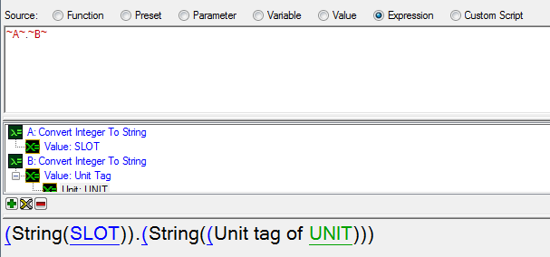
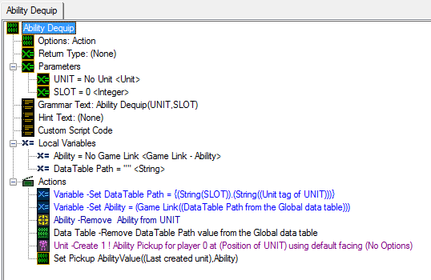
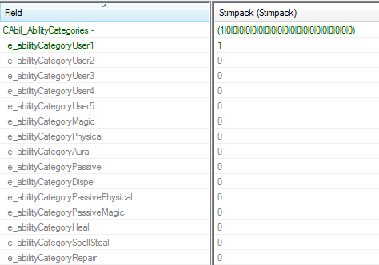
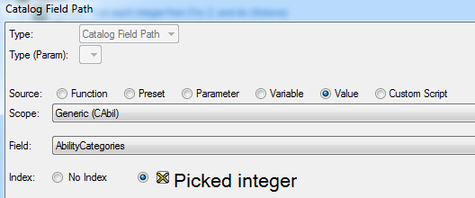
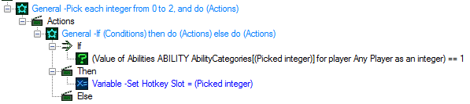
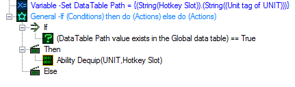
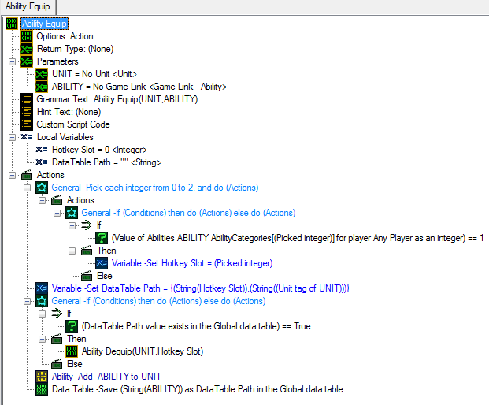
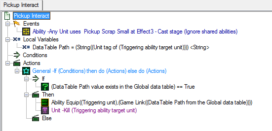

```markdown
现在，将“***DataTable Path***”变量设置为将“***UNIT***”参数的“**Unit Tag**”和“***SLOT***”参数转换为字符串并将它们组合在一起的表达式，就像下面的示例一样。

> 变量 - 设置 DataTable Path = {(String(SLOT)).(String((UNIT的单元标签)))}。


我们将创建此快捷方式，以便在以后处理数据表时可以更轻松地更改和重用它。


接下来，我们将从数据表中检索能力值。

将“***Ability***”变量设置为函数 - “**将字符串转换为游戏链接**”。对于字符串选择“**从数据表中获取值（字符串）**”，并使用“***DataTable Path***”变量作为路径。

使用“**删除能力**”值来移除我们刚刚从英雄那里获取的能力。

使用“**删除数据表值**”来清除数据表记录以避免泄漏。

> 理论上，对于这个设置，我们不需要这样做，因为我们将始终替换存储在此数据表路径中的能力值。但是，如果我们使用此触发器立即移除能力而不立即替换它，则我们绝对应该在完成后清理。


接下来，我们将在我们英雄的位置创建一个拾取单位。

最后，我们将使用之前创建的操作（“***设置拾取能力值***”）将能力注入到所创建的护盾单位中。




#### 能力装备。

概况：

装备能力将类似于我们的卸下能力。我们将要执行的操作包括：

- 检测我们要装备的能力所属的槽位

- 如果我们的英雄已经在所需的能力槽位中拥有该能力 - 卸下目前装备的能力

- 向我们的英雄添加这项能力

- 将我们的英雄在数据表记录中指定槽位有特定能力的信息保存下来

步骤：

创建一个新的操作定义，命名为“***能力装备***”。给它两个参数：一个“**单位**”类型（命名为“***UNIT***”）和一个“**游戏链接 - 能力**”类型（命名为“***ABILITY***”）。

创建一个整数类型的本地变量，命名为“***快捷键槽位***”。

创建一个字符串类型的本地变量，命名为“***DataTable Path***”。


首先 - 我们需要了解我们要装备的能力所属的类别标志。

在数据编辑器中，如果我们切换“**查看**”->“**查看原始数据**”（快捷键Ctrl-D）并查看能力中的类别标志，我们将注意到所有这些标志都只是“0”和“1”，其中“0”表示未选中，“1”表示选中。因此，我们可以使用目录触发器（“**按整数取得目录字段值**”）来获取每个标志的值作为整数。





让我们循环遍历每个标志，如果该标志返回“1” - 将其数值ID保存到“***快捷键槽位***”变量中。

创建一个“**逐个选择整数**”循环，并将起始值设置为“0”（对应于“**用户1**”标志），然后将结束值设置为“2”（对应于“**用户3**”标志）。

然后在循环内创建一个“**如果然后否则**”语句。在条件中，使用“**按整数取得目录字段值为整数**”来查看能力类别的标志（与选定的整数对应）是否为1。如果确实为1 - 则将我们的“**快捷键槽位**”变量设置为“**选定整数**”（以便我们记住该类别号“**选定整数**”已被选中）。






找到我们的快捷键槽位ID后，我们将准备好设置我们的“***DataTable Path***”变量并访问数据表检查我们的英雄是否已经在该槽位中有东西。

> 变量 - 设置 DataTable Path = {(String(快捷键槽位)).(String((UNIT的单位标签)))}

使用“**如果然后否则**”语句和“**数据表值存在**”功能来查找“***DataTable Path***”数据表记录是否存在 - 然后使用“***能力卸下***”操作来取消装备并将该能力丢弃到地面。



完成所有这些后，我们将使用“**添加能力**”操作添加一项能力。

最后，我们将在数据表中保存能力标识符，以便将来我们知道我们装备了什么。 (使用“**保存数据表值（字符串）**”。对于值，选择“**将游戏链接转换为字符串**”函数。对于路径，我们有我们的“***DataTable Path***”变量。)




### 第5部分 - 总结

现在我们可以回去修改“***拾取交互***”触发器，以利用“***能力装备***”操作。

我们还可以移除其中的任何操作。

清理之后，让我们创建一个字符串类型的本地变量，命名为“***DataTable Path***”，并将其设置为引用拾取单位的单位标签。

> DataTable Path = (String((单位标签的（触发能力目标单位）)))

接下来，我们可以创建一个“**如果然后否则**”语句。如果数据表值存在，则装备拾取中存储的能力并摧毁拾取单位。

> 能力装备((触发单位)，(游戏链接((全局数据表中的DataTable Path))))




之后，我们可以在地图上放置一堆空的拾取单位。在我们的地图初始化触发器中为它们添加能力。然后，从Zeratul的命令卡第3排中移除默认的能力按钮（以防与我们获取的拾物能力重叠），同时给予他10,000能量以确保他施放能力没有问题。运行地图，看看所有操作是如何运作的！

我们现在拥有一个功能齐全、快速简单的法术装备/交换系统。干得漂亮！

* [SpellSwapTutorial.SC2Map](SpellSwapAssets/SpellSwapTutorial.SC2Map)


注：

1) 在我的测试中，我注意到给予单位“**孵化者 - 孵化者机库**”能力偶尔会导致星际争霸崩溃，而“**装弹模式**”能力：“**卡拉克斯 - 服务机器**”则没有引起任何问题。

2) 单位身上存在32项能力的限制。移除旧能力以保持当前装备的能力数量在限制范围内。超出此限制将导致星际争霸崩溃。
```